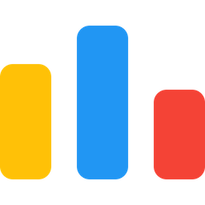

 

  

  

    
  
        I'm a Software Engineer 🧑🏻‍💻  
        Studies Computer Science & Control Systems   
        Skills  
            ✅ Data Structures & Algorithms  
            ✅ Networking & Databases  
            ✅ HTML5/CSS3/JS/BOOTSTRAP/ANGULAR/NodeJS/PHP/MYSQL/LARAVEL/RESTAPI/C++/C/C#  
            ✅ Math & Logic Enjoyer  
            🥰 Problem Solving & CP : <a href='https://codeforces.com/profile/ZedanIntrovertV' style="text-align:center">Codeforces-Profile </a>
              🥰 LeetCode: <a href='https://leetcode.com/ZedanMohamed/'>Leetcode-Profile</a>
        
    

  

